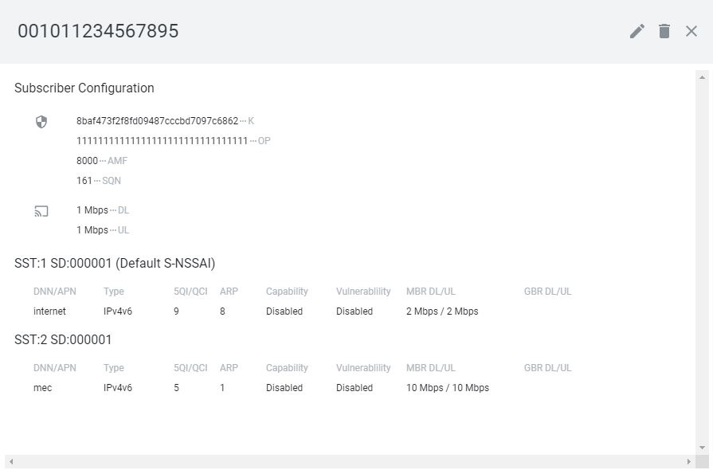

# docker_open5gs
Docker files to build and run open5gs in a docker

## Tested Setup

Docker host machine

- Ubuntu 18.04

## Build and Execution Instructions

* Mandatory requirements:
	* [docker-ce](https://docs.docker.com/install/linux/docker-ce/ubuntu)
	* [docker-compose](https://docs.docker.com/compose)


Clone repository in the comnetsemu VM and build base docker image of open5gs and ueransim

```
git clone https://github.com/herlesupreeth/docker_open5gs
cd docker_open5gs/base
docker build --no-cache --force-rm -t docker_open5gs .

cd ../ueransim
docker build --no-cache --force-rm -t docker_ueransim .
```

### Build using docker-compose

```
cd ..
set -a
source .env
docker-compose build --no-cache

```

## Configuration

For the quick run (eNB/gNB, CN in same docker network), edit only the following parameters in .env as per your setup

```
MCC
MNC
TEST_NETWORK --> Change this only if it clashes with the internal network at your home/office
DOCKER_HOST_IP --> This is the IP address of the host running your docker setup
SGWU_ADVERTISE_IP --> Change this to value of DOCKER_HOST_IP set above only if eNB/gNB is not running the same docker network/host
UPF_ADVERTISE_IP --> Change this to value of DOCKER_HOST_IP set above only if eNB/gNB is not running the same docker network/host
```

For more detailed instruction on different scenarios refer to the [docker_open5gs](https://github.com/herlesupreeth/docker_open5gs) github page

## Run experiments

### Start the network topology:
```
$ sudo python3 example1.py
```

The scenario includes 14 DockerHosts, one for each network function:
* AMF
* AUSF
* BSF
* MONGO
* NRF
* NSSF
* PCF
* SMF
* UDM
* UDR
* UPF
* WEBUI
* NR_GNB
* NR_UE

They are all connected to a central switch.
The UE starts two PDU session one for each slice defined in the core network.

Notice that at the first run the set-up should not work due to missing information in the 5GC.
To configure it we should leverage the WebUI by opening the following page in a browser on the host OS.
```
http://[VM IP]:3000/
```

Login with username "admin" and password "1423"

The configuration is as follows:

UE information:
- IMSI = 001011234567895
- USIM Type = OP
- Operator Key (OPc/OP) = 11111111111111111111111111111111
- key: '8baf473f2f8fd09487cccbd7097c6862'

Slice 1 configuration
- SST: 1
- SD: 000001
- Session-AMBR Downlink: 2 Mbps
- Session-AMBR Uplink: 2 Mbps

Slice 2 configuration
- SST: 1
- SD: 000001
- Session-AMBR Downlink: 10 Mbps
- Session-AMBR Uplink: 10 Mbps

The configuration should look like this:

</img>

### Test the environment

In two terminals start two tcpdump for both upf and upf_mec

``` 
$ ./start_tcpdump upf
``` 

#### Bandwidth test

Enter in the UE container:
``` 
# ./enter_container nr_ue
``` 

Start bandwidth test leveraging the two slices:
``` 
iperf3 -c 192.168.100.1 -B 192.168.100.2 -t 5
iperf3 -c 192.168.100.1 -B 192.168.100.3 -t 5
``` 

Open the open5gs WebUI and change the DL/UL bandwidth for slice 1.

Update the PDU session in the UE. Notice how the session is started specifying the slice, not the APN. The APN, and thus the associated UPF, is selected by the 5GC.

```
# ./nr-cli imsi-001011234567895
$ ps-establish IPv4 --sst 1 --sd 1
$ status
```
Exit with control-c

Start again a bandwidth test in the UE leveraging the new PDU session:
``` 
iperf3 -c 192.168.100.1 -B 192.168.100.4 -t 5
```
